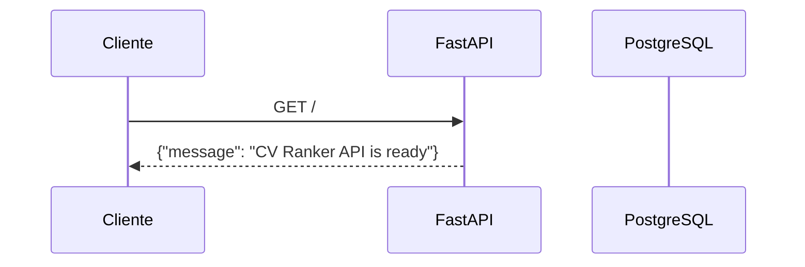
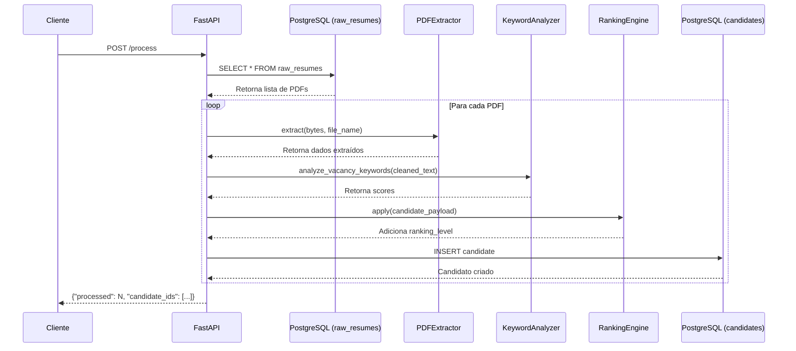
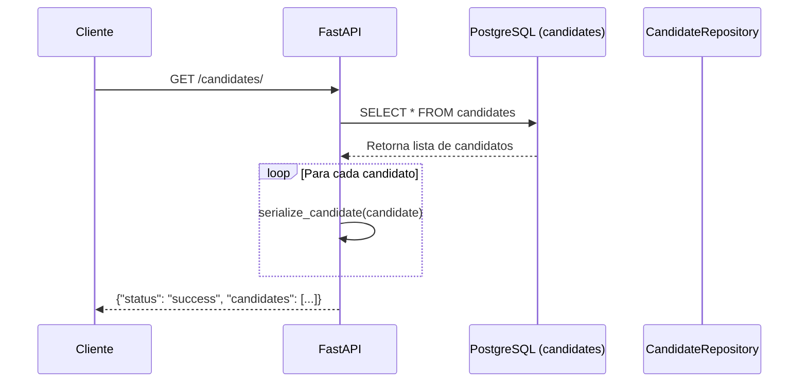
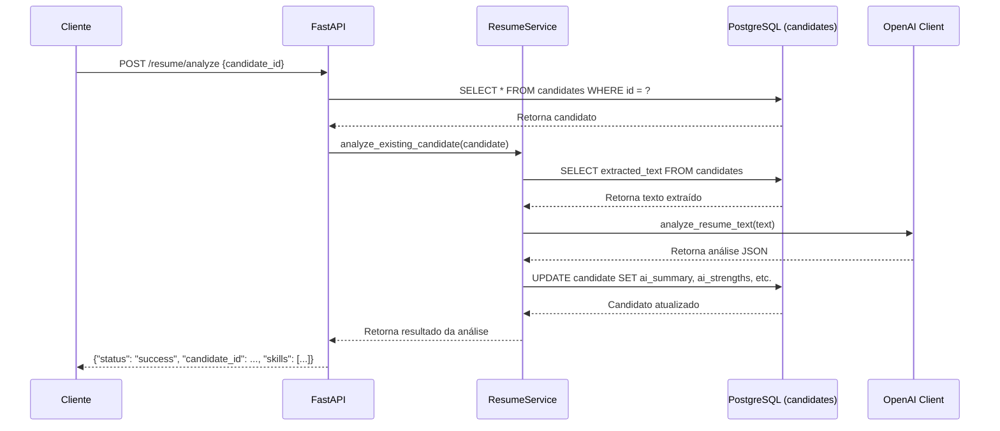
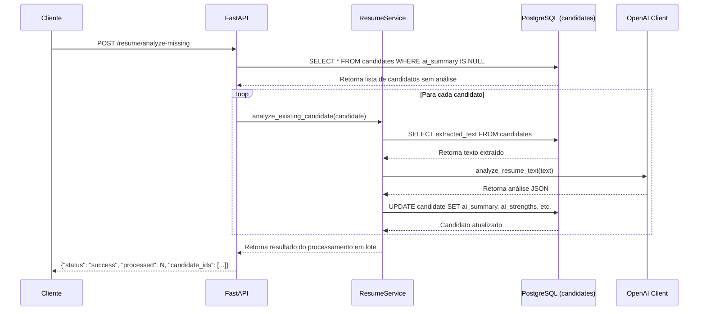
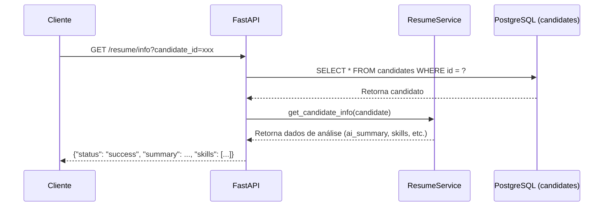

# Backend / API

Esta página explica as rotas do backend e mostra os trechos reais das funções que elas usam.

## `GET /`

Endpoint raiz da API, implementado em `src/main.py`.

```python
@app.get("/")
def root() -> dict:
    return {"message": "CV Ranker API is ready"}
```

Retorna uma mensagem de confirmação que a API está pronta.

### Fluxo do endpoint GET /



## `POST /process`

Endpoint para processamento de PDFs da tabela `raw_resumes`, implementado em `src/main.py`.

```python
@app.post("/process")
def run_processing() -> dict:
    return process_assets()
```

A função `process_assets()` consulta a tabela `raw_resumes`, processa cada PDF usando `process_pdf_from_db()` e cria candidatos na tabela `candidates`:

```python
def process_assets() -> dict:
    init_db()

    processed_ids: List[str] = []
    with SessionLocal() as session:
        vacancy = get_or_create_vacancy(session)

        raw_resumes = session.query(RawResumeModel).all()

        print(f"Encontrados {len(raw_resumes)} PDFs na tabela raw_resumes")

        if not raw_resumes:
            return {"processed": 0, "message": "Nenhum PDF encontrado na tabela raw_resumes"}

        for raw_resume in raw_resumes:
            print(f"Processando: {raw_resume.file_name}")
            existing = CandidateRepository.get_by_file_name(session, raw_resume.file_name)
            if existing:
                print(f"Já existe candidato para {raw_resume.file_name}, pulando...")
                continue

            try:
                candidate = process_pdf_from_db(raw_resume, vacancy, session)
                processed_ids.append(str(candidate.id))
                print(f"Sucesso: {raw_resume.file_name}")
            except SQLAlchemyError as exc:
                raise RuntimeError(
                    f"Falha ao salvar candidato para {raw_resume.file_name}: {exc}"
                ) from exc
            except Exception as exc:
                print(f"Falha no processamento de {raw_resume.file_name}: {exc}")

    return {"processed": len(processed_ids), "candidate_ids": processed_ids}
```

### Fluxo do endpoint POST /process



## `GET /candidates/`

Implementado em `src/routes/candidate_routes.py`.

A função `list_candidates()` abre uma sessão SQLAlchemy, consulta todos os candidatos e serializa cada registro com `serialize_candidate()`:

```python
@router.get("/")
def list_candidates():
    with SessionLocal() as session:
        candidates = CandidateRepository.get_all(session)

    return {
        "status": "success",
        "candidates": [serialize_candidate(candidate) for candidate in candidates],
    }
```

O método `serialize_candidate()` transforma o modelo em JSON e calcula o campo `skills` a partir de `ai_strengths`.

### Fluxo do endpoint GET /candidates/



O método `serialize_candidate()` transforma o modelo em JSON e calcula o campo `skills` a partir de `ai_strengths`.

## `POST /resume/analyze`

Implementado em `src/routes/resume_routes.py`. Ele recebe `candidate_id` ou `file_name` e chama `analyze_existing_candidate()`.

```python
@router.post("/analyze")
async def analyze_resume(request: ResumeAnalyzeRequest):
    try:
        analysis_result = analyze_existing_candidate(
            candidate_id=request.candidate_id,
            file_name=request.file_name,
        )

        return {
            "status": "success",
            "candidate_id": analysis_result["candidate_id"],
            "name": analysis_result["name"],
            "email": analysis_result["email"],
            "phone": analysis_result["phone"],
            "summary": analysis_result["summary"],
            "skills": analysis_result["skills"],
            "experience_years": analysis_result["experience_years"],
            "final_score": analysis_result["final_score"],
            "ranking_level": analysis_result["ranking_level"],
        }

    except Exception as e:
        raise HTTPException(status_code=400, detail=str(e))
```

A função `analyze_existing_candidate()` está em `src/services/resume_service.py` e atualiza apenas o candidato existente.

### Fluxo do endpoint POST /resume/analyze



## `POST /resume/analyze-missing`

Endpoint para análise em lote, também em `src/routes/resume_routes.py`.

```python
@router.post("/analyze-missing")
async def analyze_missing_resumes():
    try:
        result = analyze_missing_candidates()
        return {"status": "success", **result}
    except Exception as e:
        raise HTTPException(status_code=400, detail=str(e))
```

`analyze_missing_candidates()` em `src/services/resume_service.py` percorre o banco buscando candidatos sem `ai_summary` e atualiza apenas esses registros.

### Fluxo do endpoint POST /resume/analyze-missing



## `GET /resume/info`

Retorna dados de análise de IA já armazenados para um candidato, consultando por `candidate_id` ou `file_name`.

```python
@router.get("/info")
async def get_resume_info(candidate_id: Optional[str] = None, file_name: Optional[str] = None):
    try:
        info = get_candidate_info(candidate_id=candidate_id, file_name=file_name)
        return {"status": "success", **info}
    except Exception as e:
        raise HTTPException(status_code=400, detail=str(e))
```

### Fluxo do endpoint GET /resume/info


