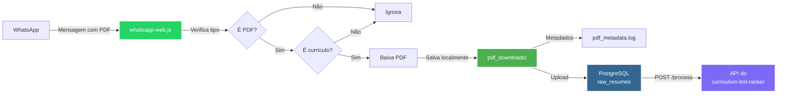

# Backend

> Documentação voltada ao backend Node.js / WhatsApp Web.js / serviços.

## Estrutura do backend

- `bot-service.js` — lógica principal do bot (monitoramento de mensagens, download de PDFs, escaneamento de conversas)
- `bot.js` — implementação alternativa com venom-bot (não utilizada atualmente)
- `database/` — persistência PostgreSQL (conexão, repositório)
- `services/` — serviços de negócio (upload de PDFs para o banco)

## Fluxo do Backend

## Seções

- Serviços
- Banco de Dados

A navegação da barra lateral atende cada seção separada e comenta as funções reais ligadas ao código.

---

## Funcionalidades principais

### Monitoramento de mensagens em tempo real

O bot monitora automaticamente todas as mensagens recebidas no WhatsApp e verifica se são documentos PDF. Se for PDF e o nome contiver palavras-chave relacionadas a currículos, o arquivo é baixado automaticamente.

### Escaneamento de conversas antigas

O bot pode escanear conversas históricas para encontrar PDFs de currículos que foram enviados anteriormente. Isso é útil para processar currículos que foram recebidos antes da ativação do bot.

### Upload para banco de dados

Os PDFs baixados podem ser enviados para o banco de dados PostgreSQL na tabela `raw_resumes`, onde serão processados pela API do curriculum-bot-ranker.

---

## Integração com WhatsApp

O bot utiliza a biblioteca `whatsapp-web.js` para se conectar ao WhatsApp Web. A autenticação é feita via QR code na primeira vez e a sessão é salva localmente para evitar escanear o QR code sempre.

### Eventos do WhatsApp Web.js

- `qr` — QR code gerado para autenticação
- `ready` — Bot conectado ao WhatsApp
- `authenticated` — Bot autenticado com sucesso
- `auth_failure` — Falha na autenticação
- `message` — Nova mensagem recebida
- `disconnected` — Bot desconectado

---

## Filtro de Currículos

O bot baixa apenas PDFs que contenham no nome:
- "curriculo" (com ou sem acento)
- "currículo" (com acento)
- "curriculum"
- "cv" (como palavra separada)

A função `isCurriculoFileName()` normaliza o texto removendo acentos e convertendo para minúsculas antes de verificar as palavras-chave.
