# Frontend

> Documentação da interface Electron do bot de WhatsApp.

## Estrutura do Frontend

- `main.js` — processo principal do Electron (criação da janela, IPC handlers)
- `index.html` — interface do usuário (HTML)
- `renderer.js` — lógica da interface (manipulação do DOM, eventos)
- `preload.js` — ponte entre processo principal e renderer (IPC)
- `style.css` — estilos da interface (baseado no design do ranker)

## Fluxo da Interface


---

## Processo Principal (main.js)

`main.js` é o ponto de entrada do Electron, responsável por criar a janela e configurar a comunicação IPC.

### Criação da Janela

```javascript
function createWindow() {
  mainWindow = new BrowserWindow({
    width: 1120,
    height: 820,
    show: false,
    webPreferences: {
      preload: path.join(__dirname, 'preload.js'),
      contextIsolation: true,
      nodeIntegration: false,
    },
  });

  mainWindow.loadFile(path.join(__dirname, 'index.html'));

  mainWindow.once('ready-to-show', () => {
    mainWindow.show();
  });

  mainWindow.on('closed', () => {
    mainWindow = null;
  });
}
```

### Inicialização do Bot

```javascript
async function startBot() {
  try {
    const userDataPath = app.getPath('userData');
    await botService.startBot(sendBotEvent, userDataPath);
  } catch (err) {
    sendBotEvent({ type: 'error', payload: err?.message || String(err) });
  }
}
```

### Envio de Eventos do Bot

```javascript
function sendBotEvent(event) {
  if (mainWindow && mainWindow.webContents) {
    mainWindow.webContents.send('bot-event', event);
  }
}
```

### IPC Handlers

```javascript
ipcMain.handle('getPdfList', async () => {
  return botService.getPdfList();
});

ipcMain.handle('dispatchSelectedPdfs', async (event, payload) => {
  return botService.dispatchSelectedPdfs(payload.files || [], payload.apiUrl || '');
});

ipcMain.handle('scanRecentChats', async (event, chatCount) => {
  try {
    return await botService.scanRecentChats(chatCount, sendBotEvent);
  } catch (err) {
    return {
      success: false,
      message: err?.message || String(err),
    };
  }
});

ipcMain.handle('openPdfFolder', async () => {
  await shell.openPath(botService.getDownloadsFolder());
  return true;
});

ipcMain.handle('uploadToDatabase', async (event, fileNames) => {
  try {
    return await botService.uploadToDatabase(fileNames);
  } catch (err) {
    return {
      success: false,
      message: err?.message || String(err),
    };
  }
});
```

---

## Renderer Process (renderer.js)

`renderer.js` contém a lógica da interface, manipulando o DOM e respondendo a eventos do usuário.

### Funções de UI

```javascript
function appendLog(text, type = 'info') {
  const line = document.createElement('div');
  line.className = `log-line ${type}`;
  line.textContent = `[${new Date().toLocaleTimeString()}] ${text}`;
  logContainer.prepend(line);
}

function setStatus(status) {
  if (!status) return;
  if (typeof status === 'object') {
    statusLabel.textContent = status.status ? `${status.status}` : JSON.stringify(status);
  } else {
    statusLabel.textContent = String(status);
  }
}
```

### Atualização da Lista de PDFs

```javascript
async function refreshPdfList() {
  try {
    const files = await window.electronApi.getPdfList();
    pdfListBody.innerHTML = '';

    if (!files.length) {
      const row = document.createElement('tr');
      row.innerHTML = '<td colspan="4" class="empty">Nenhum PDF encontrado.</td>';
      pdfListBody.appendChild(row);
      return;
    }

    files.forEach((file, index) => {
      const row = document.createElement('tr');
      row.innerHTML = `
        <td><input type="checkbox" name="pdf-checkbox" value="${file.name}" id="pdf_${index}" /></td>
        <td><label for="pdf_${index}">${file.name}</label></td>
        <td>${(file.size / 1024).toFixed(1)} KB</td>
        <td>${new Date(file.modifiedAt).toLocaleString()}</td>
      `;
      pdfListBody.appendChild(row);
    });
  } catch (err) {
    appendLog(`Erro ao atualizar lista de PDFs: ${err.message || err}`, 'error');
  }
}
```

### Manipulação de Eventos do Bot

```javascript
function handleBotEvent(event) {
  switch (event.type) {
    case 'status':
      setStatus(event.payload);
      appendLog(`Status: ${event.payload.status || JSON.stringify(event.payload)}`);
      break;
    case 'log':
      appendLog(event.payload);
      break;
    case 'pdf-saved':
      appendLog(`PDF recebido: ${event.payload.name}`);
      refreshPdfList();
      break;
    case 'error':
      appendLog(`Erro: ${event.payload}`, 'error');
      break;
    default:
      appendLog(`Evento desconhecido: ${event.type}`);
  }
}
```

### Event Listeners

```javascript
refreshButton.addEventListener('click', () => refreshPdfList());

scanChatsButton.addEventListener('click', async () => {
  const count = Number(scanCountInput.value);
  if (!count || count <= 0) {
    appendLog('Informe um número válido de conversas para escanear.', 'warn');
    return;
  }

  appendLog(`Iniciando varredura das últimas ${count} conversas...`);
  const result = await window.electronApi.scanRecentChats(count);
  if (result.success) {
    appendLog(result.message);
    refreshPdfList();
  } else {
    appendLog(`Falha na varredura: ${result.message}`, 'error');
  }
});

openFolderButton.addEventListener('click', () => window.electronApi.openPdfFolder());

uploadToDbButton.addEventListener('click', async () => {
  const selectedFiles = getSelectedFiles();
  if (!selectedFiles.length) {
    appendLog('Selecione pelo menos um PDF antes de fazer upload.', 'warn');
    return;
  }

  appendLog(`Iniciando upload de ${selectedFiles.length} arquivo(s) para o banco de dados...`);
  const result = await window.electronApi.uploadToDatabase(selectedFiles);

  if (result.success) {
    appendLog(result.message);
    if (result.errors && result.errors.length > 0) {
      result.errors.forEach((error) => appendLog(`Erro: ${error}`, 'error'));
    }
  } else {
    appendLog(`Falha no upload: ${result.message}`, 'error');
  }
});
```

---

## Preload Script (preload.js)

`preload.js` expõe APIs seguras para o processo renderer através do contexto isolado.

```javascript
const { contextBridge, ipcRenderer } = require('electron');

contextBridge.exposeInMainWorld('electronApi', {
  getPdfList: () => ipcRenderer.invoke('getPdfList'),
  dispatchSelectedPdfs: (payload) => ipcRenderer.invoke('dispatchSelectedPdfs', payload),
  scanRecentChats: (chatCount) => ipcRenderer.invoke('scanRecentChats', chatCount),
  openPdfFolder: () => ipcRenderer.invoke('openPdfFolder'),
  uploadToDatabase: (fileNames) => ipcRenderer.invoke('uploadToDatabase', fileNames),
  onBotEvent: (callback) => ipcRenderer.on('bot-event', (event, data) => callback(data)),
});
```

---

## Interface HTML (index.html)

A interface HTML contém os elementos da UI:
- Status da conexão
- Logs em tempo real
- Lista de PDFs baixados
- Botões de controle (atualizar, escanear, abrir pasta, upload)

---

## Estilos (style.css)

O arquivo `style.css` define os estilos da interface, seguindo o padrão de design do ranker com:
- Tema escuro
- Cores de destaque (roxo, verde, azul)
- Bordas arredondadas
- Layout responsivo

---

## Fluxo de Comunicação IPC

```mermaid
sequenceDiagram
    participant UI as Interface
    participant Renderer as renderer.js
    participant Preload as preload.js
    participant Main as main.js
    participant Bot as bot-service.js

    UI->>Renderer: Clique em botão
    Renderer->>Preload: window.electronApi.scanRecentChats(count)
    Preload->>Main: ipcRenderer.invoke('scanRecentChats', count)
    Main->>Bot: scanRecentChats(count, sendBotEvent)
    Bot-->>Main: Retorna resultado
    Main-->>Preload: Retorna resultado
    Preload-->>Renderer: Retorna resultado
    Renderer-->>UI: Atualiza UI

    Bot->>Main: sendBotEvent({type: 'log', payload: '...'})
    Main->>Preload: webContents.send('bot-event', event)
    Preload->>Renderer: ipcRenderer.on('bot-event')
    Renderer->>UI: appendLog('...')
```


