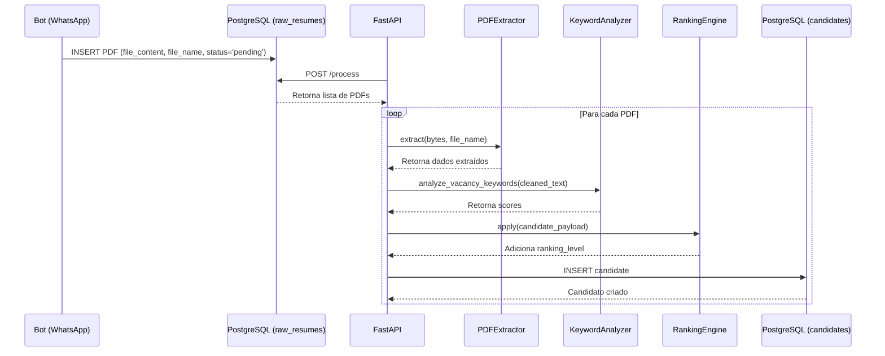

# Banco de Dados

Esta seção descreve a infraestrutura na nuvem, o gerenciamento de migrações e a arquitetura dos modelos do banco de dados (SQLAlchemy) usados pelo sistema.

---

## 1. Infraestrutura Cloud e Migrations (PostgreSQL)

Nosso banco de dados foi projetado para ser relacional, rápido e escalável, atendendo tanto o fluxo de inserção do Bot via WhatsApp quanto o processamento de IA do Backend.

* **Neon.tech (PostgreSQL Serverless):** Permite acesso remoto de toda a equipe na mesma base de dados.
* **Alembic:** Gerencia o versionamento do esquema (migrations). O arquivo `env.py` foi blindado para injetar credenciais via variáveis de ambiente (`.env`), garantindo a segurança no repositório.

### Fluxo de Inserção do Bot

Criamos a tabela `raw_resumes` para atuar como uma "caixa de entrada". O bot envia o PDF físico para lá, e a API consome de forma assíncrona.



---

## 2. Modelos principais

`src/database/models.py` define os modelos do sistema, incluindo a nossa nova tabela de entrada (`RawResumeModel`) e as tabelas analíticas (`CandidateModel`, `CandidateKeywordModel`, `VacancyModel` e `VacancyKeywordModel`).

Trecho de `CandidateModel`:

```python
class CandidateModel(Base):
    __tablename__ = "candidates"

    id = Column(UUID(as_uuid=True), primary_key=True, default=uuid.uuid4, index=True)
    full_name = Column(String(255), nullable=False)
    email = Column(String(255), nullable=True)
    phone = Column(String(50), nullable=True)
    vacancy_applied = Column(String(255), nullable=True)
    extracted_text = Column(Text, nullable=True)
    cleaned_text = Column(Text, nullable=True)
    final_score = Column(Integer, nullable=True)
    ranking_level = Column(String(50), nullable=True)
    ai_summary = Column(Text, nullable=True)
    ai_strengths = Column(Text, nullable=True)
 ```

##   3. Repositório
```src/database/repository.py``` contém métodos de consulta e atualização do banco, abstraindo as operações do SQLAlchemy.

Trecho de ```CandidateRepository```:

```Python
@staticmethod
def get_without_ai_summary(db: Session) -> List[CandidateModel]:
    return db.query(CandidateModel).filter(CandidateModel.ai_summary.is_(None)).all()

@staticmethod
def update_candidate(db: Session, candidate: CandidateModel, updates: Dict) -> CandidateModel:
    for key, value in updates.items():
        setattr(candidate, key, value)

    db.commit()
    db.refresh(candidate)
    return candidate
```
A função ```create_candidate()``` também adiciona os registros de ```CandidateKeywordModel``` com ```keyword_score```, ```occurrences``` e ```keyword_type```.