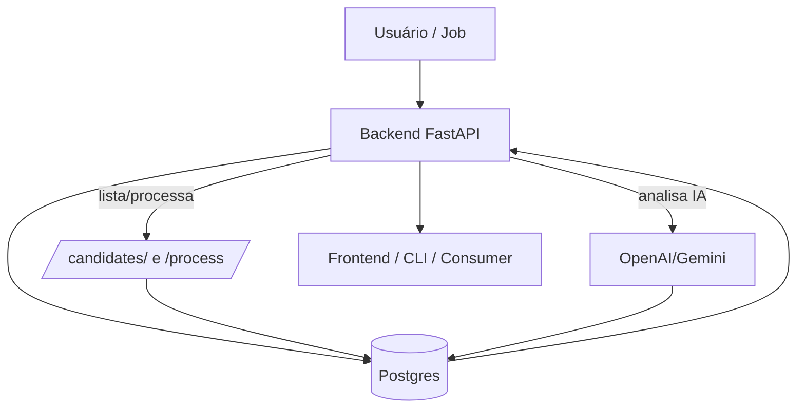

# Curriculum Bot Ranker

> Documentação técnica organizada por área.

## Seções principais

- `Backend` — rotas, serviços e integrações.
- `Frontend` — seção dedicada, atualmente sem código implementado.
- `Banco de Dados` — modelos SQLAlchemy e repositório.
- `Pipeline` — fluxos e diagramas.

## Como navegar

Use a barra lateral para abrir cada área. Cada página contém:

- explicação em texto
- função/arquivo real do código
- trechos de código relevantes

---

Apenas a seção `Frontend` está vazia porque não há código de frontend no repositório.

├── Dockerfile.backend
├── docker-compose.yaml
├── README.md
├── src/
│   ├── main.py
│   ├── clients/
│   │   └── openai_client.py
│   ├── config/
│   │   └── settings.py
│   ├── database/
│   │   ├── connection.py
│   │   ├── models.py
│   │   └── repository.py
│   ├── routes/
│   │   ├── candidate_routes.py
│   │   └── resume_routes.py
│   └── services/
│       ├── pdf_extractor.py
│       ├── keyword_analyzer.py
│       ├── ranking_engine.py
│       └── resume_service.py
└── assets/
```

Descrição breve de diretórios:
- `src/clients`: integrações externas (OpenAI).
- `src/config`: settings e variáveis de ambiente.
- `src/database`: models, connection e repository (SQLAlchemy).
- `src/routes`: rotas FastAPI.
- `src/services`: lógica de negócio (extração, análise, ranking).

---

# Fluxo Geral do Sistema

Mermaid consolidado:



---

# Observações Técnicas

- Dependências críticas: `fastapi`, `uvicorn`, `sqlalchemy`, `python-dotenv`, `PyMuPDF (fitz)`, `openai`.
- Arquivo de configuração: `src/config/settings.py` (variáveis esperadas):
  - `DATABASE_URL` (ex: postgresql://...)
  - `ASSETS_PATH` (pasta de PDFs)
  - `VACANCY_TITLE`, `VACANCY_DESCRIPTION`, `VACANCY_SENIORITY`, `VACANCY_DEPARTMENT`, `VACANCY_STATUS`
  - `OPENAI_API_KEY`
- Entradas de runtime importantes: pasta `assets/` contém PDFs de exemplo.
- Docker: existem `Dockerfile` e `Dockerfile.backend`. Para rodar o backend no container use `Dockerfile.backend` conforme `README.md`.

Pontos de atenção:
- O parsing do retorno do OpenAI assume JSON no conteúdo; o cliente tenta extrair um objeto JSON a partir do texto bruto se necessário — validar robustez para respostas inconsistentes.
- A separação entre extração e análise de IA foi implementada: `process_assets()` não chama automaticamente OpenAI — há endpoint separado `/resume/analyze-missing` para rodar IA em lote.
- `KeywordAnalyzer` usa busca simples por ocorrência de substring; pode gerar falsos positivos (palavras parciais) — considerar palavras inteiras ou lematização se necessário.

---

# Resumo Executivo

O sistema extrai currículos em PDF, normaliza o texto, realiza uma análise por palavras-chave para calcular um score e aplica uma regra simples de ranking. A integração com OpenAI gera resumos e extração de skills/seniority quando solicitada; existe uma rotina para processar apenas os candidatos sem resumo de IA. A persistência é feita via SQLAlchemy em PostgreSQL. A API principal expõe rotas para processar arquivos, listar candidatos e disparar análises de IA em lote ou individuais.

---

