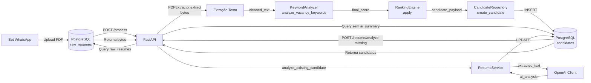
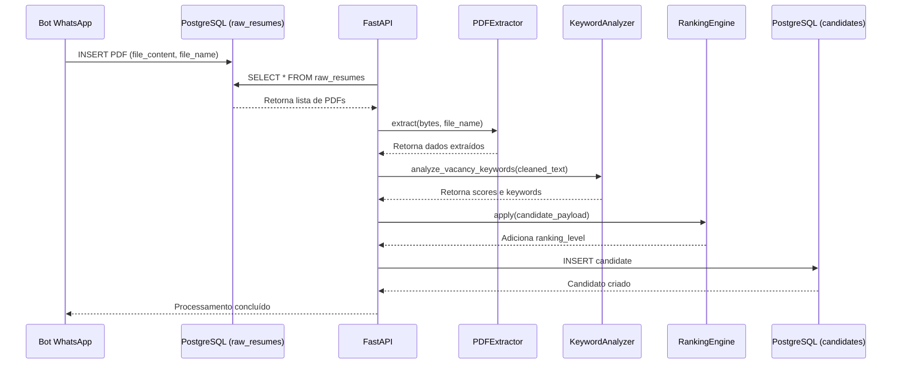
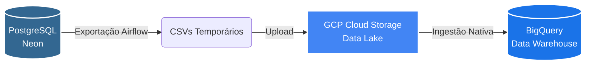

# 🔀 Pipelines do Sistema

Esta página detalha os fluxos de arquitetura do projeto. O sistema é dividido em duas grandes esteiras: a **Pipeline da Aplicação** (responsável por receber, extrair e ranquear currículos em tempo real) e a **Pipeline de Analytics** (responsável por orquestrar a carga de dados para o Data Warehouse no GCP).

---

## 1. Pipeline da Aplicação (Backend & IA)

Este fluxo representa o processamento do currículo assim que ele entra no sistema.

### Fluxo principal

### Sequência de processamento (POST /process)

---

## 2. Pipeline de Analytics (Data Engineering / Airflow)

Após o processamento pela API, a nossa esteira de dados entra em ação de forma assíncrona. A orquestração é feita pelo **Apache Airflow** (`02_carga_analytics_bq`), aplicando o conceito de ELT (Extract, Load, Transform).

### Arquitetura Cloud e Fluxo (ELT)
1. **Extract:** O Airflow conecta no PostgreSQL (Neon) e extrai os dados processados (candidatos e vagas).
2. **Load (GCS):** Os dados são exportados em CSV e enviados para a camada *Staging* do nosso Data Lake no Google Cloud Storage.
3. **Load (BigQuery):** O BigQuery ingere nativamente os dados do bucket, disponibilizando-os para dashboards e BI.

### Diagrama de Analytics e Data Lake

---

## Observação
Os diagramas usam o plugin `mermaid2` configurado em `mkdocs.yml`. Se não renderizar, abra o servidor local em `127.0.0.1:8001` e recarregue a página.

