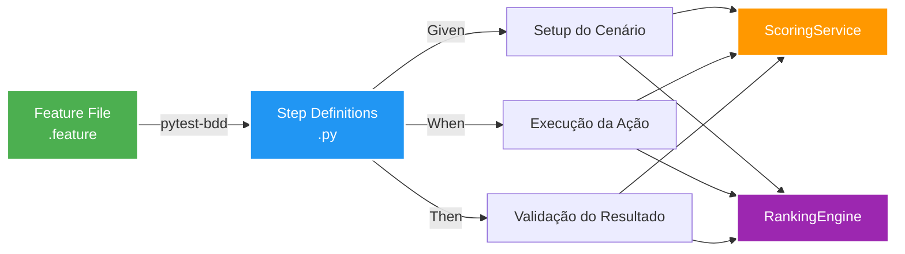

# Testes de Integração e BDD

Esta página mostra os testes de integração e BDD (Behavior Driven Development) do sistema com os trechos reais do código.

## Testes BDD

Os testes BDD estão implementados usando `pytest-bdd` e definem cenários de comportamento em linguagem natural.

### Arquivo de Feature: Score e Ranking

`tests/features/scoring_and_ranking.feature` define os cenários BDD para o cálculo de score e ranking.

```gherkin
Feature: Score e ranking de candidatos
  Validar o comportamento de cálculo de score e ranking do candidato com base nas skills exigidas.

  Scenario Outline: Calcular score com base nas skills correspondentes
    Given o candidato tem skills "<skills>"
    And o trabalho exige skills "<required_skills>"
    When o score é calculado
    Then o score deve ser <expected>

    Examples:
      | skills              | required_skills                    | expected |
      | python, sql         | python, sql                        | 100.0    |
      | python, sql         | python, aws                        | 50.0     |
      | python, sql, aws    | python, sql, aws, docker           | 75.0     |

  Scenario Outline: Determinar ranking a partir do score
    Given o candidato tem um score de <final_score>
    When o ranking é determinado
    Then o nível de ranking deve ser "<expected_ranking>"

    Examples:
      | final_score | expected_ranking |
      | 95          | EXCELENTE        |
      | 80          | EXCELENTE        |
      | 65          | BOM              |
      | 50          | BOM              |
      | 35          | MEDIANO          |
      | 30          | MEDIANO          |
      | 10          | FRACO            |
      | 0           | FRACO            |

  Scenario: Aplicar ranking ao payload do candidato
    Given um payload de candidato com final_score 72
    When o ranking é aplicado
    Then o payload do candidato deve ter ranking_level "BOM"

  Scenario: Aplicar ranking padrão quando final_score estiver ausente
    Given um payload de candidato sem final_score
    When o ranking é aplicado
    Then o payload do candidato deve ter ranking_level "FRACO"
```

### Implementação dos Passos BDD

`tests/test_scoring_and_ranking_bdd.py` implementa os passos BDD usando `pytest-bdd`.

```python
from pytest_bdd import scenarios, given, when, then, parsers

from src.services import scoring_service, ranking_engine

scenarios("features/scoring_and_ranking.feature")


@given(parsers.parse('o candidato tem skills "{skills}"'), target_fixture='candidate_skills')
def candidate_skills(skills):
    if not skills or skills.strip() == "":
        return []
    return [skill.strip() for skill in skills.split(",") if skill.strip()]


@given(parsers.parse('o trabalho exige skills "{required_skills}"'), target_fixture='required_skills')
def required_skills(required_skills):
    if not required_skills or required_skills.strip() == "":
        return []
    return [skill.strip() for skill in required_skills.split(",") if skill.strip()]


@when("o score é calculado", target_fixture='score')
def score(candidate_skills, required_skills):
    return scoring_service.calculate_score(candidate_skills, required_skills)


@then(parsers.parse("o score deve ser {expected:g}"))
def score_should_be(score, expected):
    assert score == expected


@given(parsers.parse("o candidato tem um score de {final_score:d}"), target_fixture='candidate_score')
def candidate_score(final_score):
    return final_score


@when("o ranking é determinado", target_fixture='determined_ranking')
def determined_ranking(candidate_score):
    return ranking_engine.RankingEngine.determine_ranking(candidate_score)


@then(parsers.parse("o nível de ranking deve ser \"{expected_ranking}\""))
def ranking_should_be(determined_ranking, expected_ranking):
    assert determined_ranking == expected_ranking


@given(parsers.parse("um payload de candidato com final_score {final_score:d}"), target_fixture='candidate_payload')
def candidate_payload_with_score(final_score):
    return {"final_score": final_score}


@given("um payload de candidato sem final_score", target_fixture='candidate_payload')
def candidate_payload_without_score():
    return {}


@when("o ranking é aplicado", target_fixture='payload_with_ranking')
def payload_with_ranking(candidate_payload):
    return ranking_engine.RankingEngine.apply(candidate_payload.copy())


@then(parsers.parse('o payload do candidato deve ter ranking_level "{expected}"'))
def payload_ranking_should_be(payload_with_ranking, expected):
    assert payload_with_ranking["ranking_level"] == expected
```

---

## Testes de Integração da API

Os testes de integração da API usam o `TestClient` do FastAPI para validar os endpoints com mocks do banco de dados.

### Teste de Listagem de Candidatos

```python
@patch('database.connection.SessionLocal')
def test_list_candidates(mock_session):
    mock_session_instance = MagicMock()
    mock_session.return_value.__enter__.return_value = mock_session_instance
    
    mock_candidate = MagicMock()
    mock_candidate.id = "test-id"
    mock_candidate.full_name = "Test User"
    mock_candidate.email = "test@example.com"
    mock_candidate.final_score = 15
    mock_candidate.ranking_level = "FRACO"
    
    with patch('database.repository.CandidateRepository.get_all') as mock_get_all:
        mock_get_all.return_value = [mock_candidate]
        
        response = client.get("/candidates")
        
        assert response.status_code == 200
        assert "status" in response.json()
        assert "candidates" in response.json()
        assert response.json()["status"] == "success"
```

### Teste de Validação de Campos

```python
@patch('database.connection.SessionLocal')
def test_list_candidates_has_required_fields(mock_session):
    mock_session_instance = MagicMock()
    mock_session.return_value.__enter__.return_value = mock_session_instance
    
    mock_candidate = MagicMock()
    mock_candidate.id = "test-id"
    mock_candidate.full_name = "Test User"
    mock_candidate.email = "test@example.com"
    mock_candidate.final_score = 15
    mock_candidate.ranking_level = "FRACO"
    
    with patch('database.repository.CandidateRepository.get_all') as mock_get_all:
        mock_get_all.return_value = [mock_candidate]
        
        response = client.get("/candidates")
        
        assert response.status_code == 200
        candidates = response.json()["candidates"]
        assert len(candidates) == 1
        candidate = candidates[0]
        assert "candidate_id" in candidate
        assert "full_name" in candidate
        assert "email" in candidate
        assert "final_score" in candidate
        assert "ranking_level" in candidate
```

---

## Executar Testes BDD

### Executar todos os testes BDD

```bash
pytest --gherkin-terminal-reporter
```

### Executar testes BDD específicos

```bash
pytest tests/test_scoring_and_ranking_bdd.py
```

### Executar testes BDD com coverage

```bash
pytest tests/test_scoring_and_ranking_bdd.py --cov=src --cov-report=html
```

---

## Fluxo de Testes BDD


